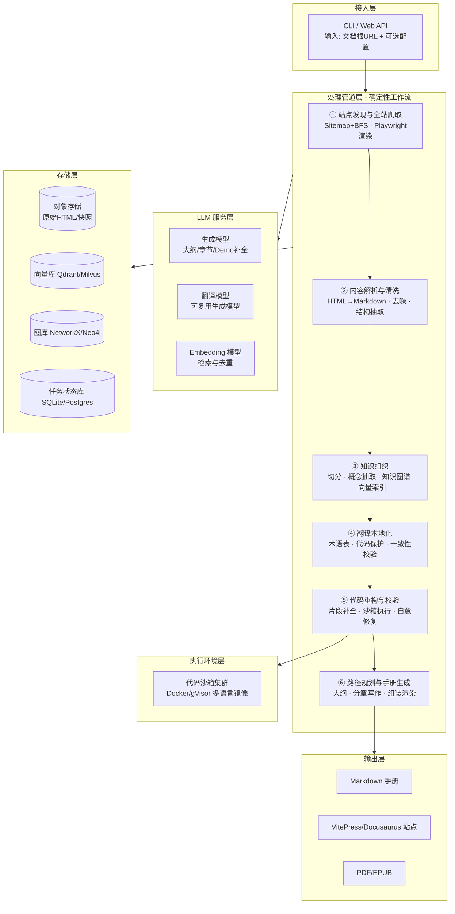
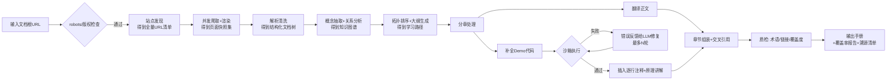

# 自动化技术文档学习手册生成系统 · 技术方案

> 输入：任意技术官方文档的根 URL（如 `https://spring.io/guides`、`https://python.langchain.com/docs/introduction/`、`https://www.elastic.co/guide/index.html`）
> 输出：一本面向零基础初学者的体系化中文学习手册（Markdown / 在线站点 / PDF），含完整可运行 Demo、逐行中文注释、学习路径。

---

## 1. 目标与设计原则

### 1.1 功能目标

| 编号 | 需求 | 对应设计 |
|---|---|---|
| 1 | 全量知识提取 | 站点发现（Sitemap + BFS 双引擎）→ 渲染级爬取 → 结构化解析 → 知识图谱（概念节点 + 依赖边），覆盖率可度量 |
| 2 | 语言本地化 | 术语表驱动的 LLM 翻译管线，代码/命令保护，风格指南约束 |
| 3 | 完整可执行 Demo 重构 | 片段代码 → 上下文推断与补全 → 沙箱真实执行 → 失败自愈重试，"跑通才入库" |
| 4 | 体系化学习路径 | 知识图谱拓扑排序 + LLM 大纲生成 + 分章写作，由浅入深、模块化 |

### 1.2 设计原则

- **Pipeline 优先，Agent 兜底**：主链路是确定性数据管道（可追溯、可重放、可断点续跑），LLM 只负责"理解、补全、写作"三类任务，不让 Agent 自由漫游。
- **中间产物全部落盘**：每一步产出结构化文件（JSON/Markdown），任何一步失败可单独重跑，便于调试与人工抽检。
- **可验证才输出**：代码必须真实执行通过；译文必须过术语一致性检查；章节必须带原文溯源链接。
- **单技术无关（tech-agnostic）**：不为某个框架写死规则，站点适配差异收敛到"适配器"层。

---

## 2. 成熟开源项目调研与参考

| 项目 | 定位 | 可借鉴点 | 局限 |
|---|---|---|---|
| **Crawl4AI**（开源，Apache 2.0） | 面向 LLM 的异步爬虫 | 自适应爬取、Markdown 输出、Playwright 渲染、可自托管无配额限制 | 需自行做全站调度与去重 |
| **Firecrawl**（开源核心 + 云服务） | URL → LLM-ready Markdown，`/map` 一键列全站链接、`/crawl` 整站爬取 | "map + scrape" 两段式全站覆盖思路；绕过 JS 渲染问题 | 云配额成本；深度定制受限 |
| **Jina Reader**（`r.jina.ai`） | 单页 → 干净文本/Markdown | 极简单页清洗，可作清洗层备选 | 无全站爬取能力 |
| **RAGFlow（DeepDoc）** | 深度文档理解 + RAG 引擎 | 版面/标题层级识别、表格解析、chunk 元数据设计 | 偏 PDF/文档，非 Web 整站 |
| **Dify / FastGPT** | AI 应用/知识库平台 | 知识库切分、检索、工作流编排的成熟产品形态 | 通用平台，不解决"手册生成"这个垂直任务 |
| **LangChain / LlamaIndex** | RAG 编排框架 | 文本切分、索引、检索的标准组件 | 只是零件，需自行组装 |
| **PocketFlow-Tutorial-Codebase-Knowledge**（12k+ Star） | AI 将代码库转成初学者教程 | 核心流程与本系统高度同构：`抓取 → 识别抽象概念 → 分析概念关系 → 章节排序 → 逐章写作`，直接验证了大纲先行、分章生成的可行性 | 面向代码库而非文档站；无翻译与代码执行校验 |
| **DeepWiki / DeepWiki-Open** | 代码仓库 → Wiki 文档站 | 知识结构化 + 交互式文档呈现的产品形态 | 同样面向代码而非文档 |
| **MinerU** | PDF 高精度解析 | 官网 PDF 版文档（如 Elastic 指南 PDF）的兜底解析 | 仅 PDF 场景 |
| **E2B / Docker + gVisor** | 代码沙箱 | AI 生成代码的安全执行环境行业标准做法 | 需按语言维护镜像矩阵 |

**结论**：没有现成项目完整覆盖"整站文档 → 中文学习手册 + 可运行 Demo"这一垂直链路。本系统 = **Crawl4AI 式爬取层 + RAGFlow 式解析层 + PocketFlow 式教程生成层 + 自研代码执行校验层**的组合与创新。

---

## 3. 整体架构

### 3.1 分层架构图



### 3.2 主流程图（一次生成任务的完整生命周期）



---

## 4. 核心模块设计

### 4.1 模块一：站点发现与全站爬取

**职责**：从根 URL 出发，拿到"全站文档页面"的完整清单并抓取渲染后的内容。

**两级发现策略（双引擎互补）**：

1. **Sitemap 优先**（覆盖率的确定性来源）
   - 探测 `/sitemap.xml`、`/robots.txt` 中的 sitemap 索引，递归展开；
   - 用 URL 前缀/路径模式过滤出"文档区"（如 `/docs/`、`/guide/`、`/manual/`），排除博客、论坛、release notes；
   - 主流文档站生成器（Docusaurus、VitePress、MkDocs、Sphinx、GitBook、Antora）都有规律 URL 结构，用**站点指纹检测**（识别 generator meta 标签 / DOM 特征）选择对应的 URL 过滤规则。
2. **BFS 增量爬取兜底**（应对无 sitemap 或 sitemap 不全的站点）
   - 从根页开始按导航侧边栏（`nav`/`aside` 语义块）优先展开链接——文档站侧边栏即目录，是全站结构最可靠的信号源；
   - 同域限制 + 路径白名单 + 最大深度（默认 6）+ 已访问集合（URL 归一化：去 hash、去 utm 参数、斜杠归一）。

**渲染与抓取**：

- 静态页走 HTTP 直连（httpx/Scrapy 风格），检测内容为 JS 壳时自动升级到 **Playwright** 无头渲染（Crawl4AI 已封装该能力，直接复用）；
- 并发控制：按域名令牌桶限速（默认 5 req/s 可配），礼貌爬取，尊重 `robots.txt` 与 `Crawl-delay`；
- 反爬兜底：UA 池、重试退避；Cloudflare 等强反爬站点标记为"需人工/半自动介入"，不硬刚。

**版本与多语言处理**：检测版本切换器（如 `/docs/5.3/` vs `/docs/current/`），默认只抓稳定版（LTS/latest stable），旧版本仅记录清单不展开；多语言站点只抓原文（通常是英文）。

**产物**：`manifest.json`（全量 URL 清单 + 站点指纹 + 版本信息）+ 每页 `raw/{hash}.html` 快照 + 抓取元数据（状态码、耗时、渲染方式）。**覆盖率指标** = 成功解析页数 / manifest 页数，写进最终报告，让"无遗漏"可度量而非口号。

### 4.2 模块二：内容解析与清洗

**职责**：HTML → 干净的结构化文档（Markdown + 元数据），保留信息、去掉噪音。

- **主内容抽取**：先走规则（识别 `<main>`/`<article>`/文档生成器的固定容器 class），失败回退 trafilatura/Readability 算法；页眉、页脚、导航、广告、cookie 横幅一律剔除。
- **结构化抽取**（这是与"普通网页转 Markdown"拉开差距的关键）：
  - 标题层级 → 文档树骨架（h1-h4 映射章节层级）；
  - 代码块 → 独立实体，记录语言标签、所在章节、前后说明段落（后文补全 Demo 时的上下文）；
  - 表格 → Markdown 表 + 同时存 JSON（参数表、配置表后面要原样保留，不许 LLM 自由发挥）；
  - 内部链接 → 解析为页面间引用边（喂给知识图谱）；
  - 图片 → 下载归档 + 生成 alt 描述（架构图类图片保留原图并在手册中引用）。
- **产物**：每页一个 `parsed/{id}.md` + `parsed/{id}.json`（标题树、代码块列表、表格、出链入链、字数、语言检测结果）。

### 4.3 模块三：知识组织与知识图谱

**职责**：把几百上千个页面组织成"可检索、可推理依赖关系"的知识底座。这是"覆盖全面无遗漏"和"由浅入深"两个需求共同的支点。

**三层组织**：

1. **切分（Chunking）**：按标题层级做结构化切分（而非傻切 500 token），每个 chunk 携带 `页面ID / 章节路径 / 前置标题` 元数据；超长章节再按语义递归细分（参考 LlamaIndex `MarkdownNodeParser` 思路）。
2. **向量索引**：Embedding 入库（Qdrant），服务于：翻译与写作时的相关上下文检索、跨页重复内容去重、概念聚类。
3. **知识图谱**：
   - **节点**：概念（如 "Bean 生命周期"、"Inverted Index"），由 LLM 从各 chunk 抽取（参考 PocketFlow 的 `IdentifyAbstractions` 节点：输入带编号的文档清单，输出 YAML 概念列表 + 关联页面索引）；
   - **边**：三类——`引用`（页面间链接，解析阶段天然获得）、`依赖`（理解 B 需要先懂 A，LLM 分析 `AnalyzeRelationships`）、`同属`（同一目录层级，站点导航结构直接给出）；
   - **存储**：默认 NetworkX 落盘为 GraphML/JSON（轻量、够用），需要可视化/多手册合并时可选 Neo4j。

**产物**：`graph.json`（概念节点 + 三类边 + 每个概念 ↔ 源 chunk 的双向映射）。这个映射关系同时解决**溯源**——手册每一段都能标注"出自官方文档第 X 页"。

### 4.4 模块四：翻译本地化

**职责**：外文 → 通顺中文，术语一致，代码原样。

- **先建术语表再翻译**：从全站高频技术名词 + 图谱概念节点出发，LLM 生成一次全局术语表（`term → 译名 → 是否保留英文`），如 `Bean → Bean（不译）`、`circuit breaker → 熔断器`。全任务共享一份 glossary，注入每一次翻译 prompt——这是术语一致性的根本手段，比事后对齐可靠得多。
- **保护性占位**：翻译前用占位符替换代码块、行内代码、命令、URL、配置键，翻译后还原，杜绝 LLM"顺手翻译代码"。
- **分段翻译 + 上下文窗口**：按 chunk 翻译，prompt 中携带"前一章摘要 + 本节标题路径"保持连贯；长章用滑窗。
- **风格指南**（注入 system prompt）：面向零基础——短句、口语化但准确、保留英文术语首次出现括注中文、禁用机翻腔句式。
- **质检**：占位符还原校验、术语表命中率校验、双语长度比异常检测（防漏译段落）。

### 4.5 模块五：代码重构与可运行校验（本方案核心差异化模块）

**职责**：把文档中片段化代码 → 自包含、可运行、极简风格、逐行中文注释的完整 Demo。**"跑通"是入库的硬门槛。**

**四步流水线**：

```mermaid
flowchart LR
    A[代码片段+上下文<br/>所在章节/前后文/相关页] --> B[补全规划<br/>确定: 语言/依赖/入口/目录结构]
    B --> C[LLM生成完整项目<br/>自包含·最小依赖·含README]
    C --> D[沙箱执行验证]
    D -->|通过| E[LLM加逐行中文注释<br/>+通俗原理讲解]
    D -->|失败| F[stderr+代码回喂LLM<br/>生成修复diff]
    F -->|≤3轮| D
    F -->|仍失败| G[标记降级: 附说明的人工todo<br/>进入人工审核队列]
    E --> H[入库: demo/{chapter}/{name}/]
```

- **上下文补全策略**：补全不是空想，LLM 拿到的上下文包 = 片段本身 + 所在章节全文 + 图谱中"依赖概念"对应的关联页面摘要 + 同站点其它页面出现的同类代码（向量检索召回）。版本号以 manifest 中的版本信息对齐（如 Spring Boot 3.x 用 `jakarta.*` 而非 `javax.*`）。
- **极简风格约束**（写入生成 prompt 的硬规则）：单文件优先、能不用依赖就不用、删光与当前知识点无关的代码、变量命名直白、输出结果可直接观察（打印到控制台）。
- **沙箱执行矩阵**（Docker 镜像预置，按需扩展）：

  | 技术领域 | 镜像 | 校验方式 |
  |---|---|---|
  | Python 系（LangChain 等） | `python:3.11-slim` + pip 依赖 | `pytest` 或直接运行脚本，断言退出码 0 |
  | Java 系（Spring 等） | `maven:3.9-eclipse-temurin-17` | `mvn -q compile` + 单测 / 启动冒烟（起进程探测端口后 kill） |
  | JS/TS 系 | `node:20-slim` | `npm ci && node index.js` / `vitest run` |
  | 中间件（ES、Redis） | docker-compose 编排：中间件容器 + Demo 容器 | Demo 连通中间件并执行读写冒烟 |
  | 纯配置/查询类（SQL、DSL） | 对应引擎容器 | 实际执行并校验返回结构 |

- **环境缓存**：同一技术的依赖安装结果（pip/maven 缓存层）跨 Demo 复用，否则一本 Spring 手册几十个 Demo 光构建就要一小时。
- **注释与讲解后置**：先跑通裸代码，再让 LLM 逐行加中文注释（注释不影响可执行性，避免"加注释加挂了代码"），末尾附"它为什么能跑"的通俗原理段。

### 4.6 模块六：学习路径规划与手册生成

**职责**：图谱 → 大纲 → 章节正文 → 成书。参考 PocketFlow-Tutorial-Codebase-Knowledge 的成熟流程，但增加了翻译、Demo、溯源。

1. **章节排序（学习路径）**：对知识图谱的"依赖边"做拓扑排序，得到概念的基础→进阶顺序；再按"同属边"聚合成模块/章。LLM 在此基础上生成目录大纲（输入：概念列表 + 描述 + 依赖关系 + 目标读者"零基础"；输出：层级化目录，每章标注 `难度★`、预计学时、前置章节、覆盖的概念节点）。**大纲即契约**：后续每章写作都拿大纲当约束，保证章与章不重复、不跳跃。
2. **分章写作**：每章的 prompt 包 = 本章大纲条目 + 该章覆盖概念对应的全部源 chunk（已翻译）+ 本章 Demo（已通过校验）+ 前后章摘要（防断层）。输出统一模板：

   ```
   # 第N章 标题
   > 本章目标 / 前置知识 / 难度 / 预计用时
   ## 1. 先讲是什么、为什么（通俗类比）
   ## 2. 核心概念拆解（配原文图表）
   ## 3. 动手试一试（完整可运行Demo + 逐行注释 + 运行结果）
   ## 4. 原理讲解（它为什么能跑）
   ## 5. 常见坑与 FAQ（来自官方文档的注意事项块）
   ## 6. 小结与延伸阅读（溯源链接 → 官方文档对应页）
   ```
3. **组装与渲染**：章节 Markdown → 按目录拼接 → 生成 VitePress/Docusaurus 站点（可选导出 PDF/EPUB，走 Pandoc）。附**全局附录**：术语表、覆盖率报告（抓了多少页、多少概念、多少 Demo、通过率）、溯源清单。

### 4.7 横切模块：质检与任务编排

- **质检关卡**（每章过一遍）：术语一致性、占位符残留、死链检查、Demo 通过率、章节 ↔ 概念 ↔ 源页面的溯源完整性。
- **任务编排**：整体用有向无环工作流执行（Prefect / Temporal / 或轻量自研 DAG runner），每步幂等、产物落盘、支持断点续跑；LLM 调用统一走带重试/限流/成本记账的网关层。

---

## 5. 推荐技术栈选型

| 层 | 选型 | 理由 |
|---|---|---|
| 主语言 | **Python 3.11+** | 爬取、NLP、LLM 生态最全；参考项目多为 Python |
| 爬虫 | **Crawl4AI**（核心引擎，封装 Playwright 渲染 + Markdown 输出）+ httpx（静态快路径）+ 自研 Sitemap/BFS 调度 | 开源可自托管、自适应爬取活跃维护；调度层必须自研才能保证覆盖率可控 |
| HTML 清洗 | trafilatura / readability-lxml + BeautifulSoup | 规则优先、算法兜底 |
| 文档解析（PDF 兜底） | MinerU | 官网仅提供 PDF 的指南类文档 |
| 切分与索引 | LlamaIndex（结构化切分）+ **Qdrant**（向量库） | 成熟组件，不重复造轮子 |
| 知识图谱 | **NetworkX**（默认，落盘 GraphML/JSON）→ Neo4j（可选增强） | 单手册场景图规模小，嵌入式足够 |
| LLM 编排 | 轻量自研节点式 pipeline（参考 PocketFlow 的 100 行框架哲学） | 流程固定，不需要 LangChain 全家桶的复杂度 |
| LLM | 生成/翻译：Claude / GPT / DeepSeek / Qwen（按成本与中文质量选配）；Embedding：`bge-m3`（中英双语好、可自托管） | 长上下文需求强（整章上下文包），优先选 128K+ 窗口模型 |
| 沙箱 | **Docker**（默认，隔离够用且到处都有）→ gVisor/E2B（对安全性要求更高的部署） | 镜像矩阵按 4.5 节维护 |
| 工作流 | Prefect（或自研 DAG runner） | 断点续跑、重试、可观测 |
| 存储 | 文件系统 + SQLite（任务状态）起步，规模化后对象存储 + Postgres | 中间产物全落盘原则 |
| 输出 | Markdown（主）→ VitePress 站点 / Pandoc 导出 PDF、EPUB | 先 Markdown 后一切皆廉价 |
| API/前端 | FastAPI + 简单 Web 控制台（提交 URL、看进度、下载手册） | 首期 CLI 亦可 |

**单本手册成本粗估**（以约 300 页文档站、80 个 Demo 为例）：翻译 + 写作 + 补全约消耗 300–600 万 token，按 DeepSeek/Qwen 价位在数十元人民币级，按 Claude/GPT 旗舰模型在数百元级；沙箱执行单机即可完成（瓶颈在 Java 系构建，缓存后可控）。

---

## 6. 关键难点与解决策略

### 6.1 难点一：全站深度爬取策略（"覆盖全面无遗漏"如何兑现）

**问题**：单入口 BFS 容易漏（孤岛页）、炸（论坛/API 参考页爆炸）、慢（JS 渲染）；不同文档站结构千差万别。

**策略**：
1. **双引擎发现**：Sitemap 给"广度确定性"，导航侧栏 BFS 给"结构正确性"，两者取并集 + 差异告警（sitemap 有但导航没有的页面，多半是隐藏页，照样抓但标注）。
2. **站点指纹 → 适配器**：识别 Docusaurus / VitePress / MkDocs / Sphinx / GitBook / Antora / 自定义 CMS，加载对应的内容容器选择器、URL 过滤规则、版本目录规则。主流文档站 80% 以上是这几家生成的，指纹库把"任意技术"收敛成"有限几种适配器 + 一个兜底通用适配器"。
3. **URL 治理**：归一化去重；按路径模式分类（`docs/guide` 要、`blog`/`community`/`changelog` 弃、`api-reference` 标记为附录资料不进正文）；深度与总量双阈值保护。
4. **覆盖率可度量**：`覆盖率 = 解析成功页 / 发现页`，附漏页清单与原因，随手册输出——不追求绝对 100%（login 墙、强反爬客观存在），追求**每一页的取舍都有记录**。
5. **增量更新**：记录每页 ETag/Last-Modified + 内容 hash，重跑时只处理变化页，支撑"文档更新 → 手册局部再生成"。

### 6.2 难点二：长文本上下文补全（整站内容远超任何模型上下文窗口）

**问题**：一个 Spring 文档站解析后可能是百万级 token，不可能一次性喂给模型；而大纲生成、代码补全、章节写作都需要"全局视野"。

**策略——大纲即契约 + 层级摘要 + 按需检索（Map-Reduce 思想）**：
1. **从不让 LLM 看全文**：全局理解通过"站点目录树（导航结构，通常只有几千 token）+ 每页一句摘要（Map 阶段并发生成）+ 知识图谱概念清单"三级压缩获得，这个压缩包控制在模型窗口内。
2. **分层生成，逐层带上下文**：
   - 大纲生成：只看压缩包 → 产出目录契约；
   - 章节写作：大纲契约 + 本章对应的**原文 chunk 全集**（知识图谱的"概念↔chunk"映射保证召回）+ 前后章摘要（衔接）；
   - 代码补全：片段 + 所在章节 + 依赖概念页摘要 + 向量检索召回的同类代码。
3. **一致性兜底**：术语表、大纲契约、章节摘要链三者注入所有 LLM 调用，替代"把所有上下文塞进一个 prompt"。
4. **超长单章**（如 Elastic 参考页单页极长）：先切后写——按小节分别翻译/讲解，组装时靠大纲契约保证结构完整，而非要求模型一次输出整章。

### 6.3 难点三：代码可运行性校验（AI 生成代码"看着对、跑不了"）

**问题**：LLM 补全的 Demo 常见依赖版本错、缺初始化步骤、API 已过时；Java/中间件类 Demo 环境重。

**策略**：
1. **沙箱真跑，不跑不入库**：静态检查（编译/lint）→ 动态执行（退出码 + 预期输出断言）双层；通过标准明确为"进程退出码 0 且关键输出模式匹配"，不接受"看起来没问题"。
2. **错误驱动的自愈回路**：`stderr + 完整代码 + 上下文` 回喂 LLM 生成修复 diff → 重跑，最多 3 轮；3 轮不过则降级为"人工 todo 标记"，绝不带病入库。
3. **版本锚定**：补全 prompt 中强制锚定 manifest 识别出的文档版本（如文档是 Spring Boot 3.2，依赖就锁定 3.2.x），从源头消灭"文档是新版、代码是老 API"的错配。
4. **环境即代码**：每种技术的运行环境写成 Dockerfile/compose 模板入库版本管理，依赖缓存层跨 Demo 复用；中间件类 Demo（ES、Kafka）用 compose 一键拉起依赖栈，Demo 跑完即销毁。
5. **通过率统计**：`Demo 一次通过率 / 修复后通过率 / 最终通过率` 作为系统质量指标持续监控，反哺 prompt 与镜像模板迭代。

### 6.4 难点四：幻觉控制与内容保真

- 所有正文生成必须基于"检索到的源 chunk"，prompt 中明确"不得引入源材料之外的事实性陈述"；
- 每段/每章携带溯源链接（概念 ↔ 源页面映射天然支持），读者可一键跳回官方原文核对；
- 数字、参数默认值、配置键这类"错一个字符就坑人"的内容，从解析阶段的表格 JSON / 代码块中**程序性注入**而非让 LLM 复述；
- 抽样质检 + 术语/占位符/死链的自动化检查作为硬性门禁。

---

## 7. 数据与中间产物约定

```
workspace/{task_id}/
├── manifest.json            # 全站URL清单、站点指纹、版本
├── raw/{url_hash}.html      # 原始快照
├── parsed/{id}.md|.json     # 结构化文档（标题树/代码块/表格/链接）
├── chunks/{id}.jsonl        # 切分结果（含章节路径元数据）
├── graph.json               # 概念节点 + 三类边 + 概念↔chunk映射
├── glossary.json            # 全局术语表
├── outline.json             # 目录大纲（难度/前置/概念覆盖标注）
├── chapters/{NN_章}.md      # 章节正文（含溯源）
├── demos/{章}/{名}/         # 完整可运行Demo（含执行报告.json）
├── report.json              # 覆盖率、Demo通过率、质检结果
└── output/                  # 手册站点 / PDF / EPUB
```

---

## 8. 里程碑规划

| 阶段 | 目标 | 验收标准 |
|---|---|---|
| M1 爬取与解析 | 模块一、二 + 两种站点指纹适配器 | 对 3 个代表性站点（Docusaurus 系 / Sphinx 系 / 自定义）覆盖率 ≥ 95%，解析后 Markdown 人工抽检合格 |
| M2 知识组织与翻译 | 模块三、四 | 图谱概念抽检准确率 ≥ 90%；译文术语一致性检查通过、无代码被误译 |
| M3 Demo 重构 | 模块五（先 Python + Node 两种镜像） | 对 LangChain 级文档站，Demo 最终通过率 ≥ 85%（含自愈），全部带逐行注释 |
| M4 成书 | 模块六 + 质检 + VitePress 输出 | 端到端：输入 LangChain 文档 URL → 输出完整中文手册站点，路径由浅入深、章章可溯源 |
| M5 加固与扩展 | Java/中间件沙箱、增量更新、成本优化 | Spring / Elasticsearch 两个站点端到端通过；增量再生成耗时 ≤ 全量 20% |

---

## 9. 风险与合规

- **版权**：官方文档多为 CC-BY / Apache 2.0 等协议，但翻译改写构成演绎作品——系统定位应为企业内部学习工具或取得授权的输出；手册中保留完整溯源与原文链接，既合规也提升可信度。
- **爬取合规**：尊重 robots.txt、限速礼貌爬取、UA 实名；强反爬站点走"用户自行导出/授权"路径，不做对抗。
- **成本失控**：每步 LLM 调用记账 + 预算上限熔断；重复内容先去重再翻译，Demo 依赖缓存复用。
- **安全**：AI 生成代码一律视为不可信代码，只在沙箱内执行，宿主机零接触。

---

## 附：参考资料

- Crawl4AI：https://github.com/unclecode/crawl4ai ；Firecrawl：https://github.com/mendableai/firecrawl ；对比文章见 [Firecrawl vs Crawl4AI](https://zackproser.com/blog/firecrawl-vs-crawl4ai)、[scrapeless 对比](https://www.scrapeless.com/en/blog/crawl4ai-vs-firecrawl)
- RAGFlow（DeepDoc 深度文档理解）：https://github.com/infiniflow/ragflow ；平台对比见 [Dify vs FastGPT vs RAGFlow](https://developer.aliyun.com/article/1727771)
- PocketFlow-Tutorial-Codebase-Knowledge：https://github.com/The-Pocket/PocketFlow-Tutorial-Codebase-Knowledge（大纲先行、分章写作流程的直接参考）
- DeepWiki-Open：https://github.com/AsyncFuncAI/deepwiki-open
- MinerU（PDF 解析）：https://github.com/opendatalab/MinerU
- 沙箱：Docker / gVisor / E2B（https://github.com/e2b-dev/e2b）
