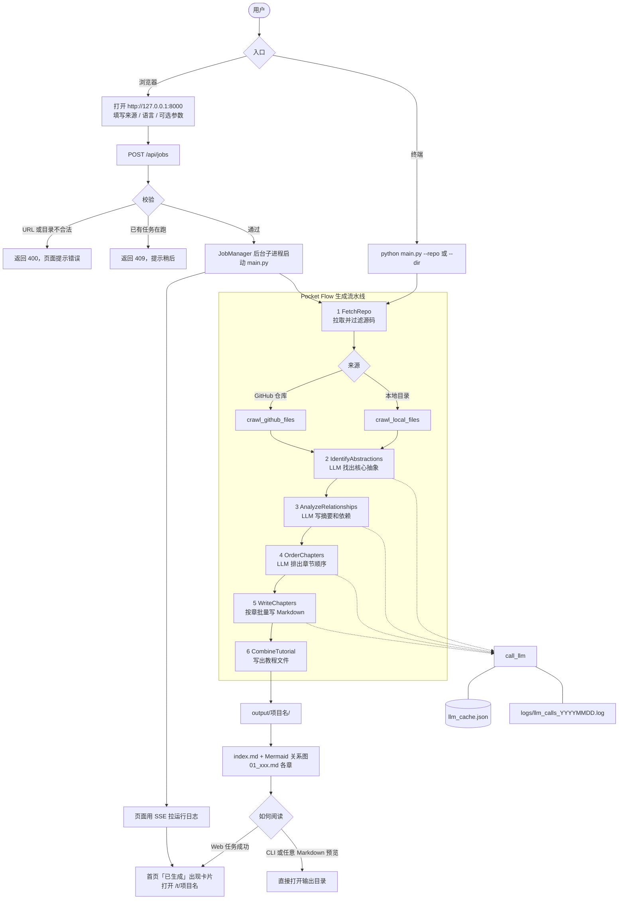
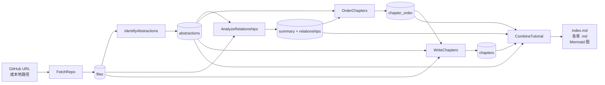

# Quick Study 项目说明书

本仓库当前代码来自开源项目
[PocketFlow-Tutorial-Codebase-Knowledge](https://github.com/The-Pocket/PocketFlow-Tutorial-Codebase-Knowledge)
（快照提交 `05b24cbbb0fe409c5e23c9791f0342f07524ffdc`，MIT License）。

它不是 Web 服务，也没有登录、数据库或后台任务队列。它是一条 **CLI 流水线**：给定一个 GitHub 仓库或本地目录，用 LLM 读代码，生成一份面向初学者的 Markdown 教程。

---

## 1. 项目做什么

把一份代码库讲清楚。输入仓库或本地路径，输出一套教程目录：

- `index.md`：项目总览、核心概念关系图（Mermaid）、章节目录
- `01_xxx.md`、`02_xxx.md` ……：每个核心抽象一章，用类比和代码片段解释它是什么、怎么和其他部分协作

典型用途：接手陌生仓库、给新人写入门材料、把大项目拆成可读的知识结构。

**输入**

- GitHub 仓库 URL（公开仓库可不带 token；私有仓库或避免限流需要 token）
- 或本地目录路径
- 可选：项目名、生成语言、包含/排除文件模式、单文件大小上限、抽象数量

**输出**

默认写到 `./output/<项目名>/`。`docs/` 里是上游已经生成好的示例教程（AutoGen、FastAPI、LangGraph 等），不是运行时产物。

---

## 2. 怎么工作

基于 [Pocket Flow](https://github.com/The-Pocket/PocketFlow)（约 100 行的 LLM 工作流框架）。用户从 **Web** 或 **CLI** 提交一次生成任务，最终都进同一条 `main.py` 流水线。Web 只是外壳：校验参数后用子进程启动 CLI，同一时刻只能跑一个任务。

### 2.1 业务流程图



读图要点：

- Web 与 CLI 在 `main.py` 汇合，后面步骤完全一样。
- `FetchRepo` 按来源走 GitHub API 或本地目录遍历，再用 include / exclude / 文件大小过滤。
- 识别、关系、排序、写章四步走 LLM；命中 `llm_cache.json` 的相同 prompt 不消耗额度。失败会按节点配置重试（最多 5 次、间隔 20 秒）。
- 产物是静态 Markdown。Web 成功后把教程挂到首页列表，用 `/t/<项目名>` 阅读。

### 2.2 流水线数据流

`flow.py` 把六个节点串成一条直线。`WriteChapters` 是 BatchNode：按章节顺序逐个调用 LLM，后面的章节能看到前面章节摘要。



| 步骤 | 作用 |
| --- | --- |
| FetchRepo | 从 GitHub 或本地目录拉取源码，按 include/exclude 和文件大小过滤 |
| IdentifyAbstractions | LLM 找出最多 N 个核心抽象，并标出相关文件下标 |
| AnalyzeRelationships | LLM 写项目摘要，并描述抽象之间的调用/依赖关系 |
| OrderChapters | LLM 排出章节顺序（先基础后上层） |
| WriteChapters | 按顺序逐章写 Markdown，后面的章节能看到前面章节摘要 |
| CombineTutorial | 写出 `index.md`、各章文件和 Mermaid 关系图 |

分析与写作都走 `utils/call_llm.py`。默认会把 prompt/response 缓存在项目根目录的 `llm_cache.json`，重复跑相同 prompt 不消耗额度。`--no-cache` 关闭缓存。调用日志写到 `logs/llm_calls_YYYYMMDD.log`。

---

## 3. 仓库结构

```text
main.py              CLI 入口
flow.py              节点编排
nodes.py             六个处理节点
utils/
  call_llm.py        LLM 调用（Gemini 或任意 OpenAI 兼容接口）
  crawl_github_files.py
  crawl_local_files.py
requirements.txt
Dockerfile
.env.sample          环境变量模板
docs/                上游示例教程 + design.md
assets/              README 配图
output/              运行后生成（已 gitignore）
```

---

## 4. 运行前准备

### 4.1 环境

- Python 3.10+（Docker 镜像是 `python:3.10-slim`）
- 能访问所选 LLM 的网络
- 分析 GitHub 仓库时建议准备 Personal Access Token（降低匿名 API 限流）

Windows PowerShell：

```powershell
cd D:\study\quick-study
python -m venv .venv
.\.venv\Scripts\Activate.ps1
pip install -r requirements.txt
```

### 4.2 配置（必须）

复制模板，填真实密钥。不要把填好的 `.env` 提交进 git（已在 `.gitignore`）。

```powershell
Copy-Item .env.sample .env
```

`main.py` 启动时会 `dotenv.load_dotenv()`，读取项目根目录的 `.env`。

**重要：** 根目录若还留着旧 Quick Study 的 `.env`（`MYSQL_*`、`REDIS_*`、`WEB_PORT` 等），那些变量新代码不会读。请按下面表格补齐 LLM 变量。

本机旧 `.env` 里如果已经有 `DEEPSEEK_API_KEY`，可以不换 Gemini，直接改成 DeepSeek：

```env
LLM_PROVIDER=DEEPSEEK
DEEPSEEK_MODEL=deepseek-chat
DEEPSEEK_BASE_URL=https://api.deepseek.com
DEEPSEEK_API_KEY=（沿用现有值，不要改名成别的）
GITHUB_TOKEN=（分析 GitHub 时建议加上）
```

注意：旧变量名 `DEEPSEEK_CHAT_MODEL` **不会**被读取，模型名必须写成 `DEEPSEEK_MODEL`。不要把密钥贴进聊天或提交到仓库。

### 4.3 环境变量

至少配通 **一种** LLM。代码以 `utils/call_llm.py` 为准（上游 README 里写的 `XAI_URL` 实际变量名是 `{PROVIDER}_BASE_URL`）。

#### 方案 A：Gemini（默认，推荐）

不设置 `LLM_PROVIDER`，只要有 Gemini 凭证就会走 Gemini。

| 变量 | 是否必须 | 说明 |
| --- | --- | --- |
| `GEMINI_API_KEY` | 二选一 | [Google AI Studio](https://aistudio.google.com/) 的 API Key |
| `GEMINI_PROJECT_ID` | 二选一 | 走 Vertex AI 时填 GCP 项目 ID |
| `GEMINI_LOCATION` | 否 | 仅 Vertex AI，默认 `us-central1` |
| `GEMINI_MODEL` | 否 | 默认 `gemini-2.5-pro-exp-03-25`。建议改成当前可用的 Gemini 2.5 Pro 型号 |

`.env` 示例：

```env
GEMINI_API_KEY=your_gemini_api_key
GEMINI_MODEL=gemini-2.5-pro
```

#### 方案 B：任意 OpenAI 兼容接口（xAI / OpenRouter / Ollama / DeepSeek 等）

设置 `LLM_PROVIDER` 后，代码会去读三组变量：`{PROVIDER}_MODEL`、`{PROVIDER}_BASE_URL`、`{PROVIDER}_API_KEY`。请求打到 `{BASE_URL}/v1/chat/completions`。

| 变量 | 是否必须 | 说明 |
| --- | --- | --- |
| `LLM_PROVIDER` | 是 | 提供者名字，例如 `XAI`、`OPENROUTER`、`OLLAMA`、`DEEPSEEK` |
| `{PROVIDER}_MODEL` | 是 | 模型名 |
| `{PROVIDER}_BASE_URL` | 是 | 根 URL，不要带 `/v1/chat/completions` |
| `{PROVIDER}_API_KEY` | 视服务而定 | 本地 Ollama 可留空 |

xAI 示例：

```env
LLM_PROVIDER=XAI
XAI_MODEL=grok-4
XAI_BASE_URL=https://api.x.ai
XAI_API_KEY=your_xai_api_key
```

OpenRouter 示例（`.env.sample` 里有 key/model，但仍需补 `LLM_PROVIDER` 和 `BASE_URL`）：

```env
LLM_PROVIDER=OPENROUTER
OPENROUTER_MODEL=google/gemini-2.5-pro
OPENROUTER_BASE_URL=https://openrouter.ai/api
OPENROUTER_API_KEY=your_openrouter_key
```

本地 Ollama：

```env
LLM_PROVIDER=OLLAMA
OLLAMA_MODEL=llama3.1
OLLAMA_BASE_URL=http://localhost:11434
```

#### 通用可选变量

| 变量 | 是否必须 | 说明 |
| --- | --- | --- |
| `GITHUB_TOKEN` | 分析 GitHub 时强烈建议 | 也可用 CLI `-t` 传入。没有 token 时公开仓库也能跑，但容易撞 rate limit |
| `LOG_DIR` | 否 | LLM 日志目录，默认 `logs` |

---

## 5. 怎么启动

### 5.0 Web 界面（推荐）

同一套 conda 环境里启动本地网页，用来提交仓库/本机目录、看日志、阅读生成后的教程。同一时间只能跑一个任务。

```powershell
conda activate quick-study
python -m uvicorn webapp:app --host 127.0.0.1 --port 8000
```

浏览器打开 http://127.0.0.1:8000

Web 只是 `main.py` 的外壳：LLM 仍然读项目根目录 `.env`。不要把服务绑到公网，页面没有登录。

先验证 LLM 通了：

```powershell
python utils/call_llm.py
```

正常会打印一次 `Hello, how are you?` 的回复。失败先查 `.env` 和网络，不要直接跑主流程。

### 5.1 分析 GitHub 仓库

```powershell
python main.py --repo https://github.com/username/repo --include "*.py" "*.js" --exclude "tests/*" --max-size 50000
```

### 5.2 分析本地目录

```powershell
python main.py --dir D:\path\to\codebase --include "*.py" --exclude "*test*"
```

### 5.3 生成中文教程

```powershell
python main.py --repo https://github.com/username/repo --language "Chinese"
```

### 5.4 命令行参数

`--repo` 和 `--dir` 必须二选一。

| 参数 | 默认 | 含义 |
| --- | --- | --- |
| `--repo` | 无 | GitHub 仓库 URL |
| `--dir` | 无 | 本地目录 |
| `-n, --name` | 从 URL/目录名推导 | 项目名，同时作为输出子目录名 |
| `-t, --token` | 环境变量 `GITHUB_TOKEN` | GitHub token |
| `-o, --output` | `./output` | 输出根目录 |
| `-i, --include` | 常见源码后缀（py/js/ts/go/java/c/cpp/md/yml 等） | 包含的 glob |
| `-e, --exclude` | tests、node_modules、.git、build 等 | 排除的 glob |
| `-s, --max-size` | `100000`（约 100KB） | 单文件字节上限，超出跳过 |
| `--language` | `english` | 教程语言，例如 `Chinese` |
| `--max-abstractions` | `10` | 识别的核心抽象上限 |
| `--no-cache` | 关闭 | 禁用 `llm_cache.json` |

默认 include：`*.py *.js *.jsx *.ts *.tsx *.go *.java *.pyi *.pyx *.c *.cc *.cpp *.h *.md *.rst *Dockerfile *Makefile *.yaml *.yml`

跑完后看：

```text
output/<项目名>/index.md
output/<项目名>/01_....md
...
```

---

## 6. 用 Docker 跑

```powershell
docker build -t pocketflow-app .
```

分析公开 GitHub 仓库，教程写到本机 `.\output_tutorials`：

```powershell
docker run -it --rm `
  -e GEMINI_API_KEY="YOUR_GEMINI_API_KEY" `
  -v "${PWD}/output_tutorials:/app/output" `
  pocketflow-app --repo https://github.com/username/repo
```

分析本机代码目录：

```powershell
docker run -it --rm `
  -e GEMINI_API_KEY="YOUR_GEMINI_API_KEY" `
  -v "D:\path\to\codebase:/app/code_to_analyze" `
  -v "${PWD}/output_tutorials:/app/output" `
  pocketflow-app --dir /app/code_to_analyze
```

私有仓库再加上 `-e GITHUB_TOKEN="..."`. 入口是 `python main.py`，`docker run` 后面的参数原样传给 CLI。

---

## 7. 成本与限制

- 一次完整生成会多次调用 LLM（识别抽象、关系、排序、每章各一次以上），大仓库 + 强模型费用不低。上游建议用带思考能力的模型。
- 默认排除测试、构建产物、`node_modules` 等；仍可能漏进无关大文件，用 `--include` / `--exclude` / `--max-size` 收窄。
- GitHub 匿名爬取很容易 403/限流，配 `GITHUB_TOKEN`。
- 产物是静态 Markdown，没有内置预览站。本地可用任意 Markdown 预览，或把 `output/` 丢进 GitHub Pages / VitePress。
- 本仓库 **不再包含** 原先的 FastAPI、Next.js、MySQL、Redis、LangGraph worker。那些栈已经从工作区移除。

---

## 8. 设计文档与上游

- 节点与数据流的详细设计：[`docs/design.md`](docs/design.md)
- 上游英文 README：[`README.md`](README.md)
- 上游仓库：https://github.com/The-Pocket/PocketFlow-Tutorial-Codebase-Knowledge
