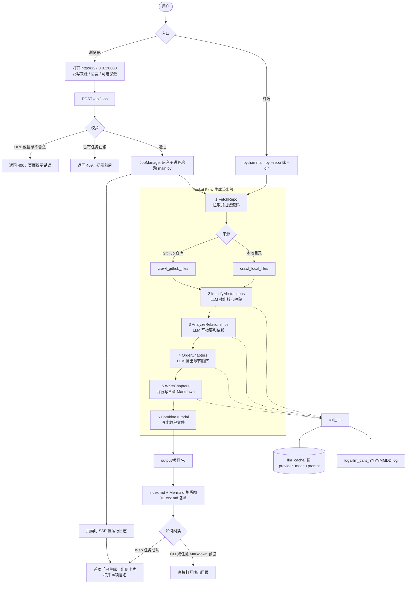
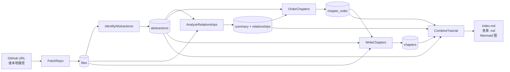

# Quick Study 项目说明书

本仓库当前代码来自开源项目
[PocketFlow-Tutorial-Codebase-Knowledge](https://github.com/The-Pocket/PocketFlow-Tutorial-Codebase-Knowledge)
（快照提交 `05b24cbbb0fe409c5e23c9791f0342f07524ffdc`，MIT License）。

它有一条 **CLI 流水线**，外加本机 **Web 界面**（默认只绑 `127.0.0.1`）：给定一个 GitHub 仓库或本地目录，用 LLM 读代码，生成一份面向初学者的 Markdown 教程。没有登录数据库；非回环绑定必须设置 `QUICK_STUDY_TOKEN`，否则拒绝启动。

---

## 1. 项目做什么

把一份代码库讲清楚。输入仓库或本地路径，输出一套教程目录：

- `index.md`：项目总览、核心概念关系图（Mermaid）、章节目录
- `01_xxx.md`、`02_xxx.md` ……：每个核心抽象一章，用类比和代码片段解释它是什么、怎么和其他部分协作

典型用途：接手陌生仓库、给新人写入门材料、把大项目拆成可读的知识结构。

**输入**

- GitHub 仓库 URL（公开仓库可不带 token；私有仓库或避免限流需要 token）
- 或本地目录路径
- 可选：项目名、生成语言、包含/排除文件模式、单文件大小上限、抽象数量

**输出**

默认写到 `./output/<项目名>/`。`docs/` 里是上游已经生成好的示例教程（AutoGen、FastAPI、LangGraph 等），不是运行时产物。

---

## 2. 怎么工作

基于 [Pocket Flow](https://github.com/The-Pocket/PocketFlow)（约 100 行的 LLM 工作流框架）。用户从 **Web** 或 **CLI** 提交一次生成任务，最终都进同一条 `main.py` 流水线。Web 只是外壳：校验参数后用子进程启动 CLI，同一时刻只能跑一个任务。

### 2.1 业务流程图



读图要点：

- Web 与 CLI 在 `main.py` 汇合，后面步骤完全一样。
- `FetchRepo` 按来源走 GitHub API 或本地目录遍历，再用 include / exclude / 文件大小过滤。
- 识别、关系、排序、写章四步走 LLM；缓存目录默认 `llm_cache/`（key = provider + model + prompt）。YAML 步骤失败按节点重试（最多 3 次、间隔 10 秒），不是旧文档里的 5×20 秒。
- 产物是静态 Markdown。Web 成功后把教程挂到首页列表（显示语言与修改时间），用 `/t/<项目名>` 阅读。封面 SVG 只出现在目录页；章节页不注入封面。Mermaid / highlight.js 使用 `web/static/vendor/` 本地文件，不走 CDN。已生成的教程页可以「问这个仓」——只根据教程正文和 `# source:` 路径回答，没有教程则拒绝（不做 RAG）。

### 2.2 流水线数据流

`flow.py` 把六个节点串成一条直线。识别 / 关系 / 排序是 YAML 步骤（temperature 0.2，重试 2–3 次）。`WriteChapters` 是 **AsyncParallelBatchNode**：多章并行写（`LLM_MAX_CONCURRENCY`，默认 5），共享目录大纲，不再串行依赖上一章正文。



| 步骤 | 作用 |
| --- | --- |
| FetchRepo | 从 GitHub 或本地目录拉取源码，按 include/exclude 和文件大小过滤 |
| IdentifyAbstractions | LLM 找出最多 N 个核心抽象，并标出相关文件下标 |
| AnalyzeRelationships | LLM 写项目摘要，并描述抽象之间的调用/依赖关系 |
| OrderChapters | LLM 排出章节顺序（先基础后上层） |
| WriteChapters | 并行写各章 Markdown（带源文件路径），共享大纲而不是上一章正文 |
| CombineTutorial | 写出 `index.md`、各章文件和 Mermaid 关系图 |

分析与写作都走 `utils/call_llm.py`。默认把 prompt/response 缓存在 `LLM_CACHE_DIR`（默认 `llm_cache/`，按 provider+model+prompt 分文件），重复跑相同 prompt 不消耗额度。`--no-cache` 关闭缓存。调用日志写到 `logs/llm_calls_YYYYMMDD.log`。默认不流式（`LLM_STREAM=0`），避免空 SSE 再打一枪非流式造成二次计费。

---

## 3. 仓库结构

不再是「六个文件的 CLI」。同一条 Pocket Flow 流水线被 CLI、本机 Web、只读 MCP、以及 `/v1` HTTP 共用。

```text
main.py              CLI 入口（quick-study：generate / ask / pages / mcp）
flow.py              节点编排
nodes.py             六个处理节点（Fetch → Identify → Relationships → Order → Write → Combine）
webapp.py            FastAPI：首页、/t 阅读、/tools、/api、/mcp、/v1
web/                 模板、静态资源、JobManager、阅读渲染
  serve.py           uvicorn 入口（quick-study-web；非回环必须 QUICK_STUDY_TOKEN）
utils/               预检、Ask、增量缓存、Pages、MCP、克隆护栏等
mcp_server.py        只读 MCP：--list / --call，以及 --stdio JSON-RPC
sdk/                 轻量 HTTP 客户端
tests/               单元测试
Dockerfile           CLI 镜像（ENTRYPOINT main.py）
Dockerfile.web       Web 镜像（绑定 127.0.0.1，compose 注入令牌）
docker-compose.yml   本机 Web（127.0.0.1:8000，需要 QUICK_STUDY_TOKEN）
pyproject.toml       pip install .  /  .[web]
requirements.txt     开发/Docker 全量依赖（含 web + Gemini 可选库）
.env.sample          环境变量模板（默认 OpenRouter z-ai/glm-5.3-flash）
docs/                上游示例教程 + design.md
assets/              README 配图
output/              运行后生成（已 gitignore）
```

| 入口 | 做什么 |
| --- | --- |
| `quick-study --repo …` / `python main.py` | 生成教程 |
| `quick-study ask <教程> "问题"` | 只根据已生成 Markdown 提问 |
| `quick-study pages <教程>` | 写出 `site/index.html` + `.nojekyll`（GitHub Pages） |
| `quick-study-web` / `python -m web.serve` | 本机 Web（默认 127.0.0.1:8000） |
| `quick-study-mcp --stdio` | Cursor 可配置的 MCP JSON-RPC（stdio） |
| `GET/POST /v1/…` | 与网页同一套教程列表 / Ask / 任务（给脚本用） |
| `GET /mcp/tools` `POST /mcp/call` | 只读 HTTP MCP（list / read / ask，禁止 generate） |

---

## 4. 运行前准备

### 4.1 环境

- Python 3.10+（Docker 镜像是 `python:3.10-slim`）
- 能访问所选 LLM 的网络
- 分析 GitHub 仓库时建议准备 Personal Access Token（降低匿名 API 限流）

Windows PowerShell：

```powershell
cd D:\study\quick-study
python -m venv .venv
.\.venv\Scripts\Activate.ps1
pip install -r requirements.txt
```

### 4.2 配置（必须）

复制模板，填真实密钥。不要把填好的 `.env` 提交进 git（已在 `.gitignore`）。

```powershell
Copy-Item .env.sample .env
```

`main.py` 启动时会 `dotenv.load_dotenv()`，读取项目根目录的 `.env`。

**重要：** 根目录若还留着旧 Quick Study 的 `.env`（`MYSQL_*`、`REDIS_*`、`WEB_PORT` 等），那些变量新代码不会读。请按下面表格补齐 LLM 变量。

默认走 **OpenRouter + `z-ai/glm-5.3-flash`**。不要把密钥贴进聊天或提交到仓库。

```env
LLM_PROVIDER=OPENROUTER
OPENROUTER_MODEL=z-ai/glm-5.3-flash
OPENROUTER_BASE_URL=https://openrouter.ai/api
OPENROUTER_API_KEY=（填你的 OpenRouter 密钥）
LLM_TIMEOUT_SECONDS=300
GITHUB_TOKEN=（分析 GitHub 时建议加上）
```

`OPENROUTER_BASE_URL` **不要**带尾部 `/v1`。客户端会请求 `{BASE_URL}/v1/chat/completions`，最终地址必须是 `https://openrouter.ai/api/v1/chat/completions`。

本机旧 `.env` 里如果已经有其他 OpenAI 兼容密钥（例如 DeepSeek），可以改 `LLM_PROVIDER` 和对应的 `{PROVIDER}_*` 变量，而不是走默认 OpenRouter。

注意：旧变量名 `DEEPSEEK_CHAT_MODEL` **不会**被读取，模型名必须写成 `DEEPSEEK_MODEL`。未设置或占位符形式的 `OPENROUTER_API_KEY` 会给出可读错误，并写明默认模型和接口。

### 4.3 环境变量

至少配通 **一种** LLM。代码以 `utils/call_llm.py` 为准。不设置 `LLM_PROVIDER` 时默认就是 OpenRouter，**不会**因为本机有 Gemini 密钥而自动切走。

#### 方案 A：OpenRouter + GLM 5.3 Flash（默认）

| 变量 | 是否必须 | 说明 |
| --- | --- | --- |
| `LLM_PROVIDER` | 否 | 默认 `OPENROUTER` |
| `OPENROUTER_MODEL` | 否 | 默认 `z-ai/glm-5.3-flash` |
| `OPENROUTER_BASE_URL` | 否 | 默认 `https://openrouter.ai/api`（不要加 `/v1`） |
| `OPENROUTER_API_KEY` | 是 | [OpenRouter](https://openrouter.ai/) 的 API Key，请求头 `Authorization: Bearer …` |
| `LLM_TIMEOUT_SECONDS` | 否 | 默认 `300`。流式读取超时按块间隔计算 |
| `LLM_MAX_CONCURRENCY` | 否 | 并行写章上限，默认 `5` |
| `LLM_CACHE_DIR` | 否 | 缓存目录，默认 `llm_cache/`（不再写单个 `llm_cache.json`） |
| `LLM_STREAM` | 否 | 默认 `0`（关闭）。打开后空流默认**不会**再打非流式，除非 `LLM_STREAM_FALLBACK=1` |
| `LLM_MAX_TOKENS` | 否 | 可选，写入请求的 `max_tokens`；用量会显示在成功卡上 |
| `JOB_TIMEOUT_SECONDS` | 否 | Web 子进程超时，默认 `3600` |
| `QUICK_STUDY_TOKEN` | 非回环绑定必须 | 绑 `0.0.0.0` 等地址时必须设置，否则拒绝启动 |

流式请求不附加额外推理字段；只拼接 `delta.content`。思考内容可能出现在 `reasoning`，进度可以长时间是 0 字。默认关闭流式，避免空流再打一枪。

#### 方案 B：Gemini（可选）

只有显式设置 `LLM_PROVIDER=GEMINI` 时才走 Gemini。

| 变量 | 是否必须 | 说明 |
| --- | --- | --- |
| `LLM_PROVIDER` | 是 | 必须写成 `GEMINI` |
| `GEMINI_API_KEY` | 二选一 | [Google AI Studio](https://aistudio.google.com/) 的 API Key |
| `GEMINI_PROJECT_ID` | 二选一 | 走 Vertex AI 时填 GCP 项目 ID |
| `GEMINI_LOCATION` | 否 | 仅 Vertex AI，默认 `us-central1` |
| `GEMINI_MODEL` | 否 | 默认 `gemini-2.5-pro-exp-03-25` |

```env
LLM_PROVIDER=GEMINI
GEMINI_API_KEY=your_gemini_api_key
GEMINI_MODEL=gemini-2.5-pro
```

#### 方案 C：其他 OpenAI 兼容接口（xAI / Ollama / DeepSeek 等）

设置 `LLM_PROVIDER` 后，代码会去读三组变量：`{PROVIDER}_MODEL`、`{PROVIDER}_BASE_URL`、`{PROVIDER}_API_KEY`。请求打到 `{BASE_URL}/v1/chat/completions`。不要把智谱官方 `/api/paas/v4` 拼进这套 `/v1` 拼接逻辑。

| 变量 | 是否必须 | 说明 |
| --- | --- | --- |
| `LLM_PROVIDER` | 是 | 提供者名字，例如 `XAI`、`OLLAMA`、`DEEPSEEK` |
| `{PROVIDER}_MODEL` | 是 | 模型名 |
| `{PROVIDER}_BASE_URL` | 是 | 根 URL，不要带 `/v1/chat/completions` |
| `{PROVIDER}_API_KEY` | 视服务而定 | 本地 Ollama 可留空 |

xAI 示例：

```env
LLM_PROVIDER=XAI
XAI_MODEL=grok-4
XAI_BASE_URL=https://api.x.ai
XAI_API_KEY=your_xai_api_key
```

本地 Ollama：

```env
LLM_PROVIDER=OLLAMA
OLLAMA_MODEL=llama3.1
OLLAMA_BASE_URL=http://localhost:11434
```

#### 通用可选变量

| 变量 | 是否必须 | 说明 |
| --- | --- | --- |
| `GITHUB_TOKEN` | 分析 GitHub 时强烈建议 | **只走环境变量**，不要用 CLI `-t` 把 token 放到 argv。没有 token 时公开仓库也能跑，但容易撞 rate limit |
| `LOG_DIR` | 否 | LLM 日志目录，默认 `logs` |

---

## 5. 怎么启动

### 5.0 Web 界面（推荐）

同一套 conda 环境里启动本地网页，用来提交仓库/本机目录、看日志、阅读生成后的教程。同一时间只能跑一个任务。

```powershell
conda activate quick-study
python -m uvicorn webapp:app --host 127.0.0.1 --port 8000
```

浏览器打开 http://127.0.0.1:8000 。**默认只绑定 127.0.0.1**。绑非回环地址必须设置 `QUICK_STUDY_TOKEN`，否则进程拒绝启动。不要在未鉴权时把 Docker / `--host 0.0.0.0` 暴露到公网。

Web 只是 `main.py` 的外壳：LLM 仍然读项目根目录 `.env`。GitHub Token 走环境变量 `GITHUB_TOKEN` 或表单（写入子进程环境），**不要**放到命令行参数。表单可填 include / exclude / max-size 收窄爬取；文件数超过阈值且未指定 include 会拒绝运行。可取消正在跑的任务。

先验证 LLM 通了：

```powershell
python utils/call_llm.py
```

正常会打印当前 `LLM_PROVIDER` / 模型 / POST 地址，以及一次 `Hello, how are you?` 的回复。没有密钥时会打印可读的 `OPENROUTER_API_KEY is not set` 说明（默认模型 `z-ai/glm-5.3-flash`）。失败先查 `.env` 和网络，不要直接跑主流程。

### 5.1 分析 GitHub 仓库

```powershell
python main.py --repo https://github.com/username/repo --include "*.py" "*.js" --exclude "tests/*" --max-size 50000
```

### 5.2 分析本地目录

```powershell
python main.py --dir D:\path\to\codebase --include "*.py" --exclude "*test*"
```

### 5.3 生成中文教程

```powershell
python main.py --repo https://github.com/username/repo --language "Chinese"
```

### 5.4 pip 安装

```powershell
pip install .
quick-study --repo https://github.com/username/repo --include "*.py"
quick-study ask Demo "入口在哪"
quick-study pages Demo
```

本机网页（可选 extra，装 FastAPI / uvicorn / Jinja2）：

```powershell
pip install ".[web]"
quick-study-web --host 127.0.0.1 --port 8000
```

开发/Docker 仍可用 `pip install -r requirements.txt`（含 web 与 Gemini 客户端）。默认模型不变：OpenRouter `z-ai/glm-5.3-flash`。

### 5.5 MCP stdio（Cursor）

只读工具：`list_tutorials` / `read_chapter` / `ask`。禁止 generate。

```powershell
python mcp_server.py --stdio
# 或：quick-study-mcp --stdio
```

Cursor `mcp.json` 示例：

```json
{
  "mcpServers": {
    "quick-study": {
      "command": "quick-study-mcp",
      "args": ["--stdio"],
      "env": { "QUICK_STUDY_OUTPUT": "output" }
    }
  }
}
```

协议是 JSON-RPC 2.0 + `Content-Length` 帧（`initialize` / `tools/list` / `tools/call`）。`--list` / `--call` 和 `GET /mcp/tools` 仍可用。

### 5.6 命令行参数

`--repo` 和 `--dir` 必须二选一。

| 参数 | 默认 | 含义 |
| --- | --- | --- |
| `--repo` | 无 | GitHub 仓库 URL |
| `--dir` | 无 | 本地目录 |
| `-n, --name` | 从 URL/目录名推导 | 项目名，同时作为输出子目录名 |
| `-t, --token` | **已弃用** | 请用环境变量 `GITHUB_TOKEN`，不要把 token 放到 argv |
| `-o, --output` | `./output` | 输出根目录 |
| `-i, --include` | 常见源码后缀（py/js/ts/go/java/c/cpp/md/yml 等） | 包含的 glob |
| `-e, --exclude` | tests、node_modules、.git、build 等 | 排除的 glob |
| `-s, --max-size` | `100000`（约 100KB） | 单文件字节上限，超出跳过 |
| `--language` | CLI 默认 `english`；Web 表单默认中文 | 教程语言，例如 `Chinese` |
| `--max-abstractions` | `10` | 识别的核心抽象上限 |
| `--no-cache` | 关闭 | 禁用 `llm_cache/` 缓存 |
| `--dry-run` | 关闭 | 只爬不写，打印文件数与估 LLM 调用后退出 |

默认 include：`*.py *.js *.jsx *.ts *.tsx *.go *.java *.pyi *.pyx *.c *.cc *.cpp *.h *.md *.rst *Dockerfile *Makefile *.yaml *.yml`

跑完后看：

```text
output/<项目名>/index.md
output/<项目名>/01_....md
...
```

---

## 6. 用 Docker 跑

CLI 镜像（`Dockerfile`，入口 `python main.py`）：

```powershell
docker build -t quick-study .
```

本机 Web 请用 `Dockerfile.web` + `docker-compose.yml`（只绑 `127.0.0.1:8000`，必须设置 `QUICK_STUDY_TOKEN`）。不要把未鉴权的 `0.0.0.0` 暴露到公网。

分析公开 GitHub 仓库，教程写到本机 `.\output_tutorials`：

```powershell
docker run -it --rm `
  -e OPENROUTER_API_KEY="YOUR_OPENROUTER_API_KEY" `
  -v "${PWD}/output_tutorials:/app/output" `
  quick-study --repo https://github.com/username/repo
```

分析本机代码目录：

```powershell
docker run -it --rm `
  -e OPENROUTER_API_KEY="YOUR_OPENROUTER_API_KEY" `
  -v "D:\path\to\codebase:/app/code_to_analyze" `
  -v "${PWD}/output_tutorials:/app/output" `
  quick-study --dir /app/code_to_analyze
```

私有仓库再加上 `-e GITHUB_TOKEN="..."`. 入口是 `python main.py`，`docker run` 后面的参数原样传给 CLI。

---

## 7. 成本与限制

- 一次完整生成会多次调用 LLM（识别抽象、关系、排序、每章各一次以上），大仓库 + 强模型费用不低。上游建议用带思考能力的模型。
- 默认排除测试、构建产物、`node_modules` 等；仍可能漏进无关大文件，用 `--include` / `--exclude` / `--max-size` 收窄。
- GitHub 匿名爬取很容易 403/限流，配 `GITHUB_TOKEN`。
- 产物是静态 Markdown。本机 Web 可阅读；`quick-study pages` 会写出 `site/index.html` + `.nojekyll` 给 GitHub Pages。
- 本机 Web 顶栏「工具」抽屉按组导航：工作台 / 对比 / Digest / PR 导读 / 热力图 / 质量 / 预设。
- 增量再生成用内容指纹缓存 Identify / relationships，未改动的步骤跳过 LLM。
- `ALLOW_GIT_HOSTS` 额外主机仍会拒绝内网、链路本地、回环（字面量与解析后）以及非 git 端口。
- Ask / 生成带系统约束，并对输出做轻量注入/密钥抽样审计（不用 embedding）。
- 本仓库 **不再包含** 原先的账号体系 / MySQL / Redis / LangGraph worker。本地 FastAPI（`webapp.py`）只做本机外壳。

---

## 8. 设计文档与上游

- 节点与数据流的详细设计：[`docs/design.md`](docs/design.md)
- 上游英文 README：[`README.md`](README.md)
- 上游仓库：https://github.com/The-Pocket/PocketFlow-Tutorial-Codebase-Knowledge
- **清单 #21–35**（本批）见 [`docs/merge-after-10-13.md`](docs/merge-after-10-13.md)：先合 PR #10–#13（#1–20），再合本批。`/v1` 稳定面见 [`docs/v1-openapi.md`](docs/v1-openapi.md)。
